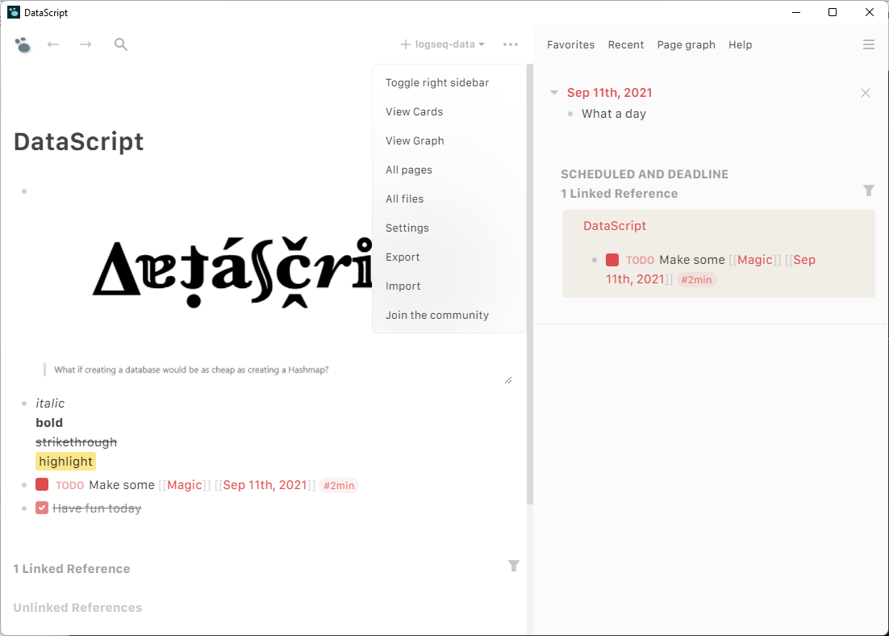
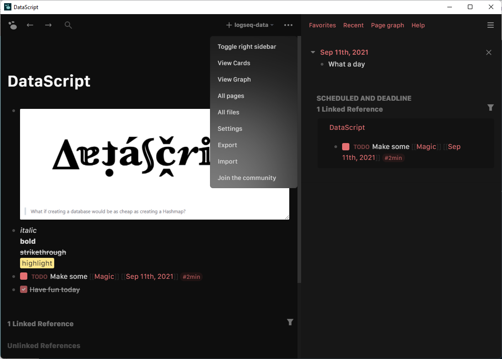

# Zu

Clean, minimal and modern theme for [[LogSeq]].

## How to install

Copy the css content of [theme.css](https://github.com/gustavofsantos/zu-theme-logseq/blob/main/theme.css) file and paste into your `custom.css` file.

## Contributing

Pull requests are welcome ❤️

## Screenshots

